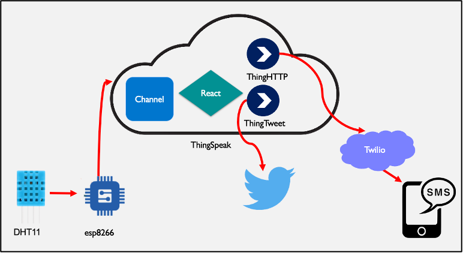

# Smart Agricultural Network

## Abstract
Smart agricultural network is a smart system that depends on both hardware components in the field and a devoted software infrastructure to transmit agricultural data. The agricultural data transmitted can be anything that will provide insightful value such as temperature, humidity, and sunlight measurements from sensors in the field. These data points can then be analyzed over time using the software in the cloud. It was proposed to optimize resource management in commercial scale agricultural systems, and can be retrofitted into existing farming, or gardening processes as required. This paper provides a summarized use case for a spread-out agricultural system: data is collected in the field and transmitted to the Cloud, then displayed in an interface where reactive prompts are triggered based on measurement thresholds.
Keywords— Agriculture, Wi-Fi enabled network, sensors, SMS Alerts, Twitter Tweet Alerts.

## I.	Introduction 
Agriculture is a growing business that feeds the world. As the global population rises, many mistakes and inefficiencies that were palatable in the past now have graver consequences. The amount of food wastage is astonishing, for all food grown and manufactured 32 % is wasted (Greid, J. 2019). Numbers like that coupled with climate change and its effects on both the global economy and agriculture supply chains will be devasting; in some parts of the world this devastation is being felt more than others. 
The smart agricultural network is a smart system that monitors agricultural data in the field from any remote location to some cloud infrastructure for visualization, analysis, and scheduled action. 

---
The project is comprised of several systems; however, it is not yet complete. To summarize the architectural implementation the project can be divided into a perception, networking and application layer. 

The list below is a checklist of all that we've accomplished so far:
- [x] ThingSpeak Public Channel (represents Main Display Hub)
- [x] ThingSpeak Private Channels (represents Main Control Field Units)
- [x] Reactive SMS Notifications 
- [x] Reactive Twitter Notifications via Bot Account 
- [x] Wi-Fi comms. from ESP8266 nodeMCU (Main Control Field Unit) to ThingSpeak.
- [x] DHT11 data to ESP8266 (direct for the moment, since Lo-Ra is not set up yet)
- [ ] Lo-Ra on ESP8266 
- [ ] Lo-Ra on Surbodinate Field Units
- [ ] Lo-Ra comms between Main Control and Surbodinate Units. 

**NOTE**: On project completion, directions will be given for implementation.

---

## II.	Implementation

The Figure 2 below represents our technology stack. The data is collected from a sensor in the field, it is transmitted through a Wi-Fi enabled device to the Cloud. The cloud infrastructure handles data visualization and contains backend logic to update all the visuals according to the use case. The cloud infrastructure also uses third party APIs to send alerts to the client through common applications such as Twitter; the more crucial updates are given to the user via SMS. 
The use case in this report focuses on a single sensor – the DHT11 – which collects both temperature and humidity measurements in its vicinity. The DHT11 sensor represents a sensor in the field, and it was connected to an ESP8266 NodeMCU. The ESP8266 NodeMCU is a Wi-Fi enabled microcontroller that acts as a gateway for information coming from the field. Refer to Figure 1 below. The data is transmitted to the ThingSpeak platform which serves as the Cloud infrastructure for this project. This is achieved by using the Write API POST request; there is code on the ESP8266 which constructs a json based request from the private ThingSpeak channel to update its fields based on the incoming field values from the sensor. 
 

The reason for using a private ThingSpeak channel was to ensure that in the event these agricultural readings were not for public consumption, other users would not have access. For the use case, there are three private channels which represent data coming from three different locations around the world – Kenya, Mongolia, and Canada. These values were then consolidated into a public channel aptly named Main Display Channel which serves as the main hub for data visualization across the entire agricultural enterprise. This layer serves in providing some encapsulation for how the farm owners or clients display their data to the public. 
 

Finally, each of the private channels – representing each of the field locations around the globe – have ThingHTTP and ThingTweet React components which allow the system to prompt the user of certain desirable or undesirable conditions depending on how they are set up. For this use case, each location was given a range of acceptable values and whenever that threshold was passed the system would use the reactive components to either Tweet and/or send an SMS. In a real-world application, one would configure the system to Tweet non-crucial or desirable facts or conditions about the field locations. And SMS prompts will be used for cautionary, undesirable conditions when human intervention is required as soon as possible.   

                                             

                               

## III.	Applications
The are several applications of the smart agricultural network since it provides value in the way of resource optimization and on tap information about otherwise inaccessible or remote farming locations. Some of these applications are as follows:
- **Real-time SMS Notification**: Based on the use case outlined, the value offered can be recognized as real-time response through SMS notifications. 
- **Farming Resource Visualization**: A client may visualize their resource usage through the ThingSpeak channel. Based on the use case, through temperature and humidity readings from the DHT11 sensor. Although neither heating nor irrigation actuators were implemented, if a field location such as an indoor farm that pays for heating was measure their resource usage in terms of heating and water consumption, this will be possible by measuring the temperature and humidity values at different locations of the field.
- **On-Tap Information**: Using a mobile device, a client or stakeholder can see the conditions that their crops are flourishing in. This can be achieved by simply logging in with a Mat-Lab account with access to said channel or by seeing the Tweets from said channel. 
- **Automatic Resource Management**: This application was not covered in the use case, but it is possible to use a system of sensors for reading measurements and accompanying actuators to automatically control the environment based on some given set point of said measurements. For example, a temperature gauge and a heater could be employed together to monitor and change the temperature in an indoor farm in a field location in Canada.

## IV.	Challenges

1.	**Security and Privacy**: The only security measure implemented in the use case was the layer of encapsulation in the public channel which provided a comprehensive plot of the private channels. The user may control what they want the public to see, and in a farming use case this should be more than enough security. However, if a client will need to implement additional security measures if they hope to safeguard their data against other forms of hacks and prying eyes.

2.	**Data management**: Potentially, the system can be easily configured to collect and transmit more data to the ThingSpeak platform. However, it falls on the analyst to determine what type of data is most for data visualization and what others are even more crucial to attach reactive prompts to. 

3.	**ESP8266 Fatal Crash**: ESP8266 NodeMCU had a fatal crash and needed to be rebooted using a python tool. To do this, the python tool was cloned from GitHub courtesy of espressif at https://github.com/espressif/esptool

Then it was built and run, though not without some trouble. This effectively formatted the NodeMCU and restored it to Factory settings. 

4.	**Unstable ESP8266 NodeMCU Wi-Fi Connection**: The image below shows the serial monitor of the ESP8266 NodeMCU as it establishes a connection with the ThingSpeak Private Channel for the Location in Canada. The values which go into field are from the DHT11 Temperature and Humidity Sensor. 

Notice that some log entries described successful uplink, and other times the uplink failed. After the fatal crash of the ESP8266 node, it was hard to say what caused these disturbances. 

5.	**LoRa Network Problems**: This application was not covered in the use case, but the original idea was to involve other node devices in a minimal scale Lo-Ra network. The team was not able to implement a Lo-Ra network to take of the advantage of the long-range network that LoRa enables [4].  

The Lo-Ra enabled component would have made long ranged communication between several nodes possible. For an end user this would have meant the installation of several monitoring systems for different regions – measuring distances up to 10 km apart – in a star topology network. The value of that expansion is obvious in the industry, especially when one factors in that no long-distance wiring or battery replacements would be scheduled for a long time, since Lo-Ra communication consumes very little power.

## V.	Conclusion
The smart agricultural network integrates sensing and networking technologies to bring consolidate functionality around optimal resource management and waste prevention in agriculture. The economic potential, especially if complemented with LoRa, is great. By mitigating 32% wastage to even 20% wastage will mean millions more get fed. It also has the potential to minimize global warming problems, since agricultural endeavors play a big part in climate change issues. More information on this project can be found in our GitHub repository.

## VI.	References

[1]	Subhidh, “Subhidh/smart-agriculture: A project on agriculture that decides when to irrigate the crops, can monitor the health and diseases using machine learning as well,” GitHub. [Online]. Available: https://github.com/subhidh/Smart-Agriculture. [Accessed: 29-Nov-2021]. 
[2]	A. Ghosh, “Building IOT Smarter Smoke Alarm with esp8266, mq2 -text notification,” SrcCodes, 31-Aug-2020. [Online]. Available: https://www.srccodes.com/iot-smoke-alarm-esp8266-mq2-gas-sensor-twilio-cloud-sms-thingspeak-analytics-mqtt/. [Accessed: 29-Nov-2021]. 
[3]	Sayali S.Makone, D.G. Khairnar, Trupti Wagh, “Smart Agriculture using LoRaWan and ThingSpeak Cloud Platform,” [Accessed: 29-Nov-2021].
[4]	“What is Lora®?,” Semtech. [Online]. Available: https://www.semtech.com/lora/what-is-lora. [Accessed: 29-Nov-2021]. 
[5]	J. Greig, “Researchers zero in on farm level food waste,” Farmtario, 19-Feb-2019. [Online]. Available: https://farmtario.com/news/researchers-zero-in-on-farm-level-food-waste/. [Accessed: 29-Nov-2021]. 
